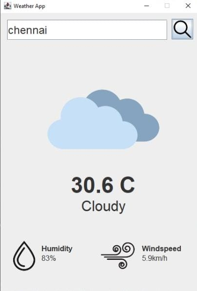

# Weather App

## Overview
The Weather App is a simple Java Swing application that allows users to check the weather for a specific location.



## Features
- Displays current weather information for a given location.
- Supports fetching weather data for various cities worldwide.

## Requirements
- Java Development Kit (JDK) 8 or later
- Internet connection for fetching weather data

## Usage
1. Clone the repository to your local machine:
    ```bash
    git clone https://github.com/your-username/weather-app.git
    ```
2. Compile the Java source files:
    ```bash
    javac *.java
    ```
3. Run the application:
    ```bash
    java AppLauncher
    ```
4. Enter the location for which you want to check the weather and press Enter.
5. The application will display the current weather information for the specified location.

## Example
To check the weather for Tokyo, simply type "Tokyo" and press Enter.

## Contributing
Contributions are welcome! If you find any bugs or have suggestions for improvement, please open an issue or create a pull request.

## License
This project is licensed under the [MIT License](LICENSE).
